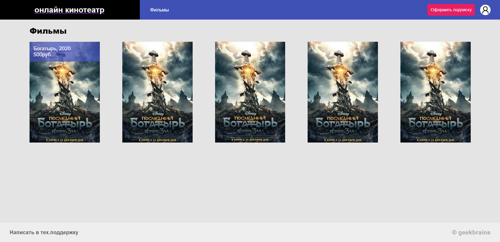
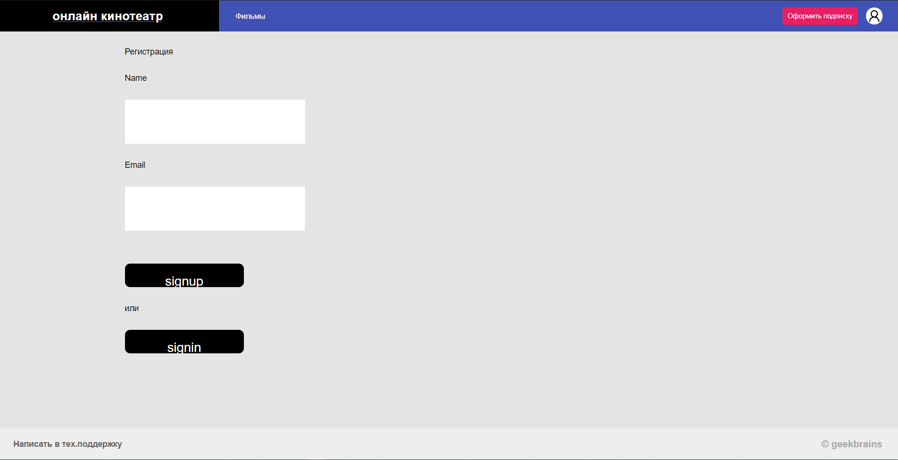
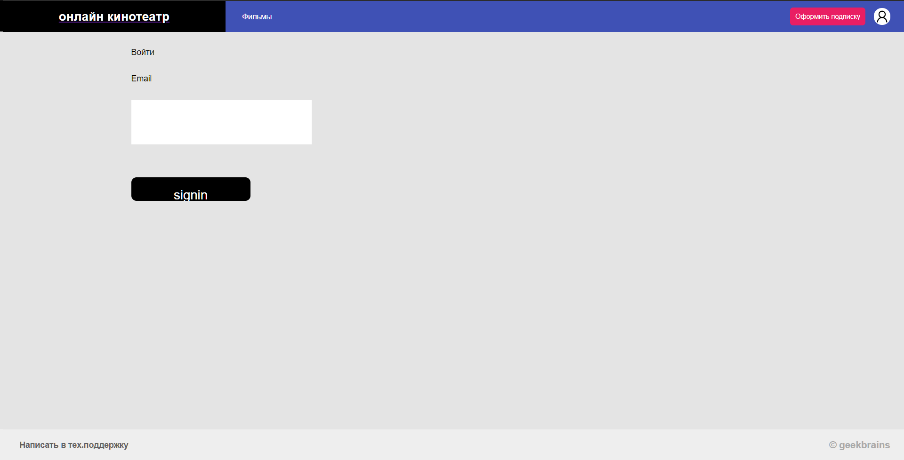
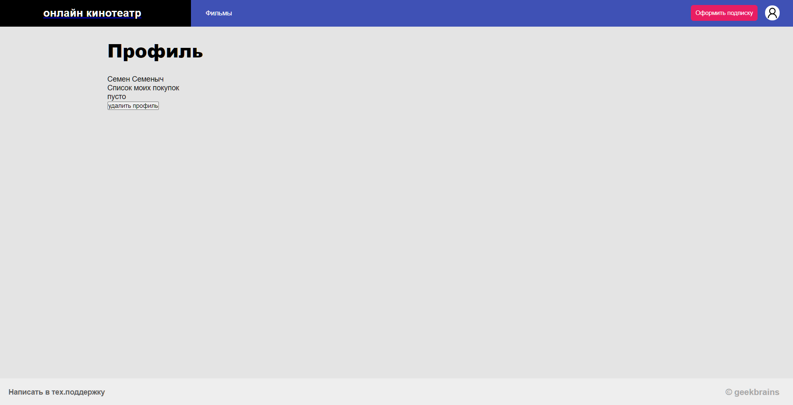
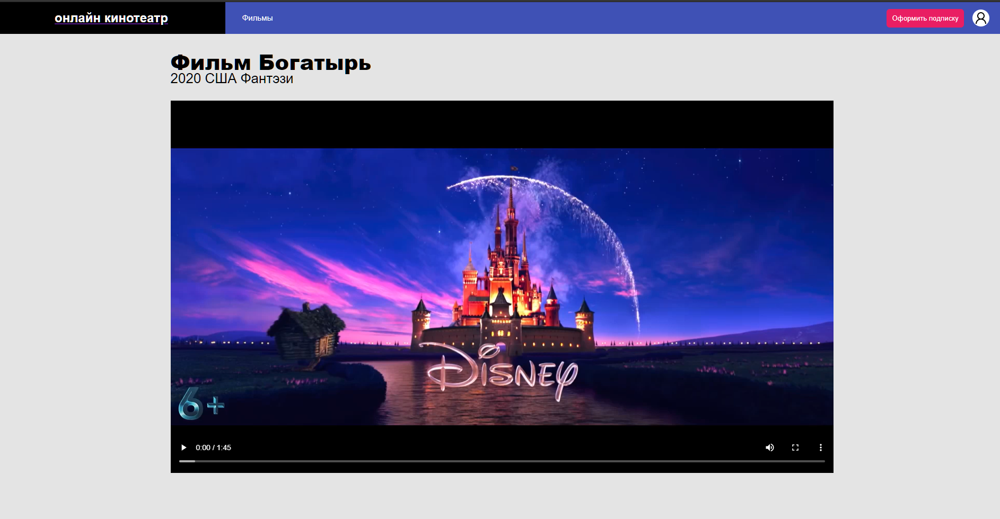
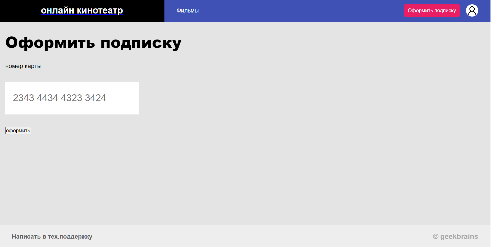
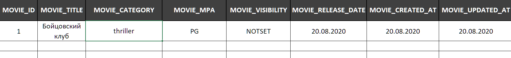

# ●	веб-приложение, которое занимается рендерингом странички на сервере и выдачей готового HTML в браузер

# index

# signup

# signin

# profile

# watch

# payment

# Принцип работы

---

# Пользователь имеет 3 статуса

* анонимный, 
* зарегистрированный, 
* оформивший подписку

## Возможно требуется добавить сервисы:

### Сервис обратной связи support

### Сервис комментариев

---

# Базы данных

Базы данных будут содержать следующие микросервисы:

* user
* movie
* payment

## База данных movie

## название базы данных MySQL

DB_SERVICE_MOVIE

Содержит:
---

## id 

MOVIE_ID

## название фильма

MOVIE_TITLE

## жанр 

MOVIE_CATEGORY

## год выпуска

MOVIE_RELEASE_DATE

## возрастной рейтинг NOTSET, P, PG, R

MOVIE_MPA

## статус фильма - видимость фильма

MOVIE_VISIBILITY

## дополнительно

MOVIE_CREATED_AT
MOVIE_UPDATED_AT

## SQL

create table TABLE_SERVICE_MOVIE (

	MOVIE_ID INT,
	MOVIE_TITLE VARCHAR(50),
	MOVIE_CATEGORY VARCHAR(50),
	MOVIE_RELEASE_DATE DATE,
	MOVIE_MPA VARCHAR(50),
	MOVIE_VISIBILITY VARCHAR(50),
	MOVIE_CREATED_AT DATE,
	MOVIE_UPDATED_AT DATE

); 
insert into TABLE_SERVICE_MOVIE (

		MOVIE_ID,
		MOVIE_TITLE,
		MOVIE_CATEGORY,
		MOVIE_RELEASE_DATE,
		MOVIE_MPA,
		MOVIE_VISIBILITY,
		MOVIE_CREATED_AT,
		MOVIE_UPDATED_AT
	)

values (

		1,
		'Back to the USSR - takaisin Ryssiin',
		'Comedy|Drama',
		'7/15/2020',
		'tristique.txt',
		'Duobam',
		'11/5/2019',
		'8/9/2020'
	);

Также на странице должен быть плеер с фильмом. Стриминг видео — это отдельная большая и сложная тема, которую мы не будем рассматривать в данном курсе. Поэтому встроим на страницу iframe YouTube с трейлером фильма.
